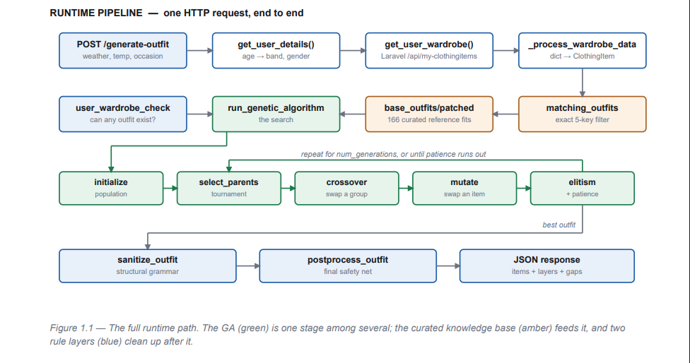

# Own Your Style

**An outfit recommendation system that reasons about clothes you actually own.**


Photograph a garment → it is segmented, described, and classified into a structured attribute record.  
Ask for an outfit → a genetic algorithm searches your wardrobe for a combination that suits the weather, temperature, and occasion — scoring candidates against 166 curated reference outfits.

Built as a **Graduation Project** at Damascus University  
(Flutter client + Laravel API + two Python ML services)


### Walkthrough

https://github.com/user-attachments/assets/234c7804-b035-49db-ba89-52c26c09b8fa

---

## Contents

- [How it works](#how-it-works)
- [Architecture](#architecture)
- [Repository layout](#repository-layout)
- [The attribute extraction service](#the-attribute-extraction-service)
- [The genetic algorithm](#the-genetic-algorithm)
- [Getting started](#getting-started)
- [API reference](#api-reference)
- [Known limitations](#known-limitations)

---

## How it works

The system has two distinct jobs, and they use different techniques because they
are different kinds of problem.

**Understanding a garment** is a perception problem. A photo arrives with no
metadata; the system has to decide what the item *is* and what properties it has.
This is handled zero-shot by two vision models working together — one describes
the image in open language, the other classifies it into a fixed taxonomy.

**Assembling an outfit** is a combinatorial search problem. With a few dozen
garments the space of valid combinations is far too large to enumerate, and
"good outfit" is a soft, multi-objective judgment rather than a single correct
answer. This is handled by a genetic algorithm.

---

## Architecture

Four components, three of them services:

| Component | Stack | Port | Responsibility |
|---|---|---|---|
| `app/` | Flutter + GetX | — | Mobile client |
| `backend/` | Laravel 12 + Sanctum | 8000 | Auth, wardrobe CRUD, weather proxy |
| `ml/feature-extraction/` | Python + Flask | 5001 | Photo → structured attributes |
| `ml/genetic/` | Python + Flask | 5002 | Wardrobe → recommended outfit |

The Flutter app talks to all three services. 
The genetic service calls back into the Laravel API using the user’s bearer token,
so recommendations always reflect the **live wardrobe**.



*The full runtime path for one recommendation request. The GA (green) is one
stage among several — the curated knowledge base (amber) feeds it, and two rule
layers (blue) clean up after it.*

---

## Repository layout

```
own-your-style/
├── app/                      Flutter client
├── backend/                  Laravel API
├── ml/
│   ├── feature-extraction/   FashionCLIP + Florence-2 attribute service
│   └── genetic/              Genetic algorithm outfit composer
└── docs/                     Diagrams
```

---

## The attribute extraction service

Turns a raw photo of one garment into a machine-readable attribute record.

### Why two models

**[Florence-2-base](https://huggingface.co/microsoft/Florence-2-base)** generates
a free-text description. It is open-vocabulary, so it reports details nobody
enumerated in advance — in the worked example below it independently recovered the
toe shape, the closure, the pattern, the colours, *and* read the brand name off a
label. What it will not do is hand you a clean value your database can store.

**[FashionCLIP](https://huggingface.co/patrickjohncyh/fashion-clip)** is CLIP
fine-tuned on fashion product data. It is the decider: given a fixed candidate
list, which one matches? It returns calibrated confidences you can threshold on,
and it understands domain vocabulary that general CLIP fumbles — peplum, bootcut,
espadrille. What it will not do is tell you about anything outside the list you
gave it, and when the true answer is absent it still returns a confident winner.

So: **Florence-2 describes, FashionCLIP decides**, and the caption arbitrates when
CLIP is unsure. When category confidence falls below threshold, the system embeds
the caption as text and matches it against category-name embeddings — a text-to-text
comparison that sidesteps the image entirely and is far more reliable when the
photo is poor.

### Design decisions

**Zero-shot, not fine-tuned.** No labelled dataset exists for a taxonomy of this
granularity, and building one for ~140 categories was not feasible. Every
classification is zero-shot over natural-language candidate labels. The
consequence is that the taxonomy is *data, not code* — adding a category means
adding a dictionary entry, not retraining.

**Prompts as definitions.** Candidate labels are never bare words. Each is
`"<value> (<disambiguating clause>)"` — for example
`"crop (top ends noticeably above the natural waist, exposing the midriff)"`.
CLIP's text encoder scores a descriptive sentence far more reliably than a
one-word token, which is a known weakness with fashion jargon.

**Group-conditional schemas.** Attributes are only extracted if they exist for
the predicted group. Footwear gets `style`/`closure`/`height`/`toe`; tops get
`sleeve`/`neckline`/`fit`/`length`. Asking for the sleeve length of a handbag is
not merely wasted compute — softmax always names a winner, so it produces a
confident, wrong answer.

**Three preprocessed views of one image.** Background removal produces an RGBA
cutout, which is then derived into three inputs, each matched to its consumer: the
cutout itself for colour extraction (where background pixels would poison the
K-means), a white-flattened copy for captioning (a VLM shown a transparent PNG
describes the checkerboard), and a tight 224×224 crop for classification (so the
garment fills CLIP's native input rather than floating in whitespace).

**Colour as family, not hex.** K-means over the non-transparent pixels finds the
dominant cluster, which is then bucketed into brights / pastels / neutrals /
darks by saturation and value. The downstream consumer reasons about colour
harmony; it needs families, not `#E8B4C8`.

### Worked example

The notebook ships with one saved output — a Jimmy Choo ballet flat:

```json
{
  "category_group": "Footwear",
  "category": "Ballet flats",
  "color_group": "pastels",
  "pattern": "floral",
  "material": "blend",
  "style": "flats",
  "closure": "slip-on",
  "toe": "round toe"
}
```

---

## The genetic algorithm

The part of this project that is genuinely a search problem.

### Why a GA

Outfit assembly is combinatorial and multi-objective. There is no single correct
answer, constraints conflict (a formal occasion in cold rain), and the objective
is soft. A GA handles all three: it explores a large space cheaply, tolerates a
fitness function assembled from competing terms, and degrades gracefully when the
wardrobe is too sparse for a perfect answer.

The population is seeded from **166 curated reference outfits**, so the search
starts from human-plausible templates rather than random noise.

### Chromosome

An `Outfit` is a **variable-length** list of `ClothingItem` objects — not a
fixed-length vector, because outfits legitimately vary in size: a dress replaces
top plus bottom, outerwear is conditional. Each gene carries its category group,
category, and a **category-gated** attribute dict, so a shoe never carries a
neckline.

### Fitness

Additive, four terms:

```
fitness =  similarity to the best-matching curated outfit
        +  wardrobe value        (static value − penalty, so disliked items decay)
        +  per-item contextual rating
        −  hard-rule penalty
        −  colour-cohesion penalty
```

**Constraints are graded penalties, not hard filters.** This is the most
consequential design decision here. Shorts at a formal event cost 120; wrong
formal footwear for the gender, or suede in rain, costs 80; heavy outerwear in
heat costs 20. Because violations are *expensive* rather than *forbidden*, the
algorithm still returns the best available outfit for a sparse wardrobe instead
of failing to return anything — degradation over dead ends.

Colour cohesion deducts 30 when three or more non-neutral colour groups appear
with no neutral to anchor them.

### Operators

| Stage | Approach |
|---|---|
| **Selection** | Tournament, size `max(2, population/10)`. Chosen over roulette because fitness is unbounded and can go negative under penalties, which breaks proportional selection. |
| **Crossover** | Category-group swap — pick a group both parents share, exchange those items wholesale. Preserves outfit structure, so you never produce two pairs of shoes and no top. |
| **Mutation** | Per-gene replacement from the wardrobe, excluding already-chosen IDs, with separate handling for base categories and accessories to prevent duplicate accessory groups. |
| **Convergence** | Elitism (best individual copied forward unchanged) plus early stopping after `patience` generations without improvement. |

Every child passes through `sanitize_outfit` after crossover and mutation, so
invalid combinations are **repaired rather than discarded** — important with small
populations, where discarding would collapse diversity.

### Parameters

```
population_size  10
num_generations  100
mutation_rate    0.16
crossover_rate   0.1
patience         50
```

An honest note: with `crossover_rate` at 0.1 and `mutation_rate` at 0.16, this
leans on mutation-driven local search rather than recombination. That is
defensible for a population of 10 — recombination has little diversity to work
with at that size — but it is a deliberate trade, not an oversight.

---

## Getting started

Requires PHP 8.2+, Composer, MySQL, Python 3.8+, and the Flutter SDK. A CUDA GPU
with ≥6 GB VRAM is strongly recommended for the ML service; it runs on CPU, but a
single request takes minutes.

### 1. Backend — port 8000

```bash
cd backend
composer install
cp .env.example .env
php artisan key:generate
# set DB_DATABASE and OPENWEATHER_API_KEY in .env
php artisan migrate
php artisan serve
```

### 2. Feature extraction — port 5001

```bash
cd ml/feature-extraction
python -m venv venv && source venv/bin/activate   # Windows: venv\Scripts\activate
pip install -r requirements.txt
jupyter notebook AI_Fashion_Flask_GPU_5.ipynb
# run cells in order; the final cell starts the server and blocks
```

First run downloads roughly 1.7 GB of model weights (Florence-2 ≈ 0.9 GB,
FashionCLIP ≈ 0.6 GB, U²-Net ≈ 176 MB).

### 3. Outfit generation — port 5002

```bash
cd ml/genetic
pip install -r requirements.txt
python genetic.py
```

### 4. Flutter app

```bash
cd app
flutter pub get
flutter run
```

On a physical Android device over USB, forward all three ports:

```bash
adb reverse tcp:8000 tcp:8000
adb reverse tcp:5001 tcp:5001
adb reverse tcp:5002 tcp:5002
```

### Credentials

No secrets are committed. The backend reads its keys from `.env` (see
`.env.example`); the Python services read `NGROK_AUTH_TOKEN` from the environment
and run without a tunnel if it is unset.

---

## API reference

### `GET /api/weather` → Laravel, port 8000

Server-side OpenWeatherMap proxy, so the API key never ships in the mobile
binary. Requires a Sanctum bearer token. Accepts either `city` (+ optional
`country`) or `lat`/`lon`. Responses are cached for 10 minutes.

```json
{
  "city": "Damascus",
  "country": "SY",
  "temperature_celsius": 22.5,
  "condition": "Clouds",
  "humidity": 60,
  "wind_speed_mps": 3.4,
  "icon_code": "04d"
}
```

`condition` may be an empty string, meaning *unknown* — clients must not map that
onto a default category.

Errors: `404` city not found · `422` validation · `502` upstream failure ·
`503` key not configured.

### `POST /clothingitems` → feature extraction, port 5001

`multipart/form-data` with an `image` field. Returns the attribute record plus
the background-removed cutout as base64.

### `POST /generate-outfit` → genetic algorithm, port 5002

Requires the same Sanctum bearer token as the Laravel API.

```json
{ "temperature": 22.5, "weather": "clear", "occasion": "casual" }
```

`weather` ∈ `clear · snowy · cloudy · rainy`
`occasion` ∈ `casual · formal · sport · party · wedding`

---

## Known limitations

- Both Python services run Flask's development server — single-threaded and not
  production-grade.
- The extraction pipeline writes intermediates to fixed filenames in the working
  directory, so concurrent requests would overwrite each other. Requests must be
  serialised until that is moved to per-request temporary paths.
- Rejecting a non-fashion image returns `200` with `data: ["this is not
  fashion"]` — an array where every other response carries an object. The client
  special-cases it, so it works, but a `422` with a structured body would be the
  correct contract.
- The feature extraction service currently runs as a notebook rather than a
  standalone script.
- Model weights download at runtime, so first startup requires network access.


## Project Info

* Title: امتلك أناقتك – نظام خزانة ذكية لتنسيق الملابس
* University: Damascus University – Faculty of Informatics Engineering
* Type: Graduation Project (Bachelor of Artificial Intelligence)
* Year: 2025


